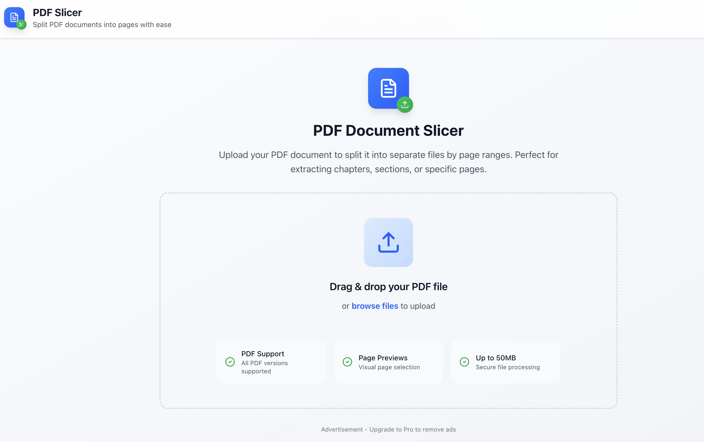

# PDF Slicer


A modern, browser-based application for extracting page ranges from PDF documents. Split your PDFs into smaller, manageable pieces with an intuitive drag-and-drop interface and secure client-side processing.



## ✨ Features

### Core PDF Processing
- **Drag & Drop Upload**: Seamless file upload with visual feedback and validation
- **Page Thumbnails**: Infinite scroll grid view with optimized loading
- **Visual Page Selection**: Click pages to set start/end ranges intuitively
- **Range Management**: Add multiple page ranges with live preview
- **Batch Processing**: Slice multiple ranges simultaneously with progress tracking
- **Smart Downloads**: Individual PDF files or bulk ZIP archives

### Security & Performance
- **Rate Limiting**: Upload and slicing rate limits to prevent abuse
- **File Validation**: Size, type, and content security checks
- **Memory Management**: Browser memory monitoring and limits
- **Client-Side Processing**: No server storage - everything happens in your browser
- **Error Boundaries**: Graceful error handling with auto-recovery

### User Experience
- **Responsive Design**: Modern UI that works on all devices
- **Progress Tracking**: Real-time slicing progress with detailed feedback
- **Infinite Scroll**: Smooth thumbnail loading without manual pagination
- **Dark Mode Ready**: Clean, professional interface
- **Accessibility**: Keyboard navigation and screen reader support

## 🚀 Tech Stack

### Frontend
- **Next.js 14** (React 18 + TypeScript)
- **Tailwind CSS v4** for modern, responsive styling
- **PDF.js** for PDF rendering and thumbnail generation
- **pdf-lib** for PDF manipulation and slicing
- **JSZip** for ZIP archive creation

### Security & Performance
- **Client-side processing** (no server storage required)
- **Web Workers** for non-blocking PDF rendering
- **In-memory blob storage** for temporary file persistence
- **Rate limiting** and validation for security
- **Memory monitoring** to prevent browser crashes

## 📦 Installation

```bash
# Clone the repository
git clone <repository-url>
cd pdf-epub-slicer

# Install dependencies
cd frontend
npm install

# Start development server
npm run dev
```

Open [http://localhost:3000](http://localhost:3000) in your browser.

## 🎯 Usage

### Simple 5-Step Process
1. **Upload**: Drag & drop a PDF file (up to 50MB)
2. **Preview**: Browse page thumbnails in infinite scroll grid
3. **Select**: Click start page, then end page to create ranges
4. **Slice**: Process selected ranges into separate PDF files
5. **Download**: Get individual files or a complete ZIP archive

### Security Features
- **File validation** ensures only valid PDFs are processed
- **Rate limiting** prevents abuse (max 5 uploads/minute, 10 slices/minute)
- **Memory monitoring** protects against browser crashes
- **Client-side processing** keeps your files completely private

## 🔧 Configuration

### Security Limits (Built-in)
- **File Size**: 50MB maximum per PDF
- **Upload Rate**: 5 uploads per minute
- **Slice Rate**: 10 slicing operations per minute  
- **Memory Limit**: 500MB browser memory usage
- **Page Range**: Maximum 100 pages per slice

### Supported Formats
- **PDF**: Any standard PDF file (version 1.0-2.0)
- **File Types**: `.pdf` files only

## 🚀 Deployment

### Render.com (Recommended)
The app is optimized for Render deployment:

```bash
# Build command
npm run build

# Start command  
npm start
```

### Other Platforms
Works on any Node.js hosting platform:
- Vercel
- Netlify
- Heroku
- AWS
- Docker

## 🛠️ Development

### Project Structure
```
pdf-epub-slicer/
├── frontend/                 # Next.js application
│   ├── app/                 # App router pages
│   ├── components/          # React components
│   │   ├── upload/         # File upload & validation
│   │   ├── viewer/         # PDF viewer & thumbnails
│   │   ├── slicer/         # Page selection & slicing
│   │   └── ui/             # Shared UI components
│   ├── lib/                # Core libraries
│   │   ├── pdf/            # PDF processing & rendering
│   │   ├── security/       # Security & rate limiting
│   │   └── utils/          # Utilities & validation
│   └── types/              # TypeScript definitions
├── backend/                 # Future API routes
└── shared/                 # Shared utilities
```

### Key Components
- `DocumentViewer`: PDF preview with infinite scroll thumbnails
- `FileUpload`: Drag & drop with security validation
- `PageSelector`: Visual page range selection interface
- `SliceManager`: Task management, progress tracking & downloads
- `SecurityStatus`: Rate limiting and memory monitoring display

## 🔮 Future Plans
- **Password-Protected PDFs**: Support for encrypted PDF files
- **OCR Integration**: Text extraction from scanned PDFs
- **Batch Processing**: Multiple file uploads and processing
- **Advanced Security**: Enhanced rate limiting and abuse prevention
- **Performance Optimization**: Faster rendering and processing

## 📝 License
MIT License - see LICENSE file for details.

## 🤝 Contributing
Pull requests welcome! Please read the development guidelines in `PROJECT_PROMPT.md`.